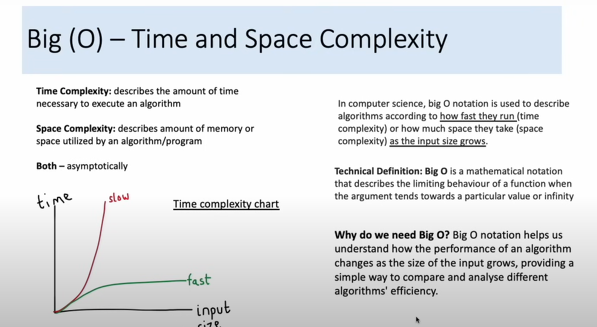

Youtube link: https://www.youtube.com/watch?v=lvO88XxNAzs&list=LL&index=6&t=386s
8:17 8/12 18:06

Big(O) - Time and space complexity

asymptotically: tiem can

Big(O) Linear example

For number in list: 
    if number == 2
        return True
    else: 
        continue
return false

Big(O) - Reference Chart

Big O summary from fastest to slowest
O(1) - Constant - Time taken regardless of size input 
Ex: Accessing an element in a array by index

O(log N) - Logarithmic - Time taken increases logarithmically as the input size grows. Operations are typically halved at each step. Time increases linearly as N goes up exponentially. 
Ex: Binary search in sorted array

O(N) - Linear - Time taken increases proportionally to the size of the input. If N double, time taken double
Ex: Finding an item in an insorted list

O(N log N) - Linearithmic - Time taken increase in a linearithmic manner, often seen in divide and comquer algorithms
Ex: Merge sort or quicksort

O(N^2) - Quadratic - Time taken increase quadratically as the input size grows. Each element needs to be compared to every other element (nested group)
Ex: Bubble sort or selection sort

O(2^N) - Exponential - Time taken doubles with each addition to N, leading to rapidly growing execution times.
Ex: Finding all subsets of set

O(N!) - Factorial - Time taken increase factorially with each increase in input size, leading to extremly slow execution times.
Ex: Solving the traveling salesman problem exhaustively.

Problem solving

Read the problem twice to understand it - (ask clarifying questions)

Try think basically of different ways to slove problem

Think end to end E2E of the best solutions based on complexity

Write the Algorithm from patterns in drawing

Code it out

Try and improve it once you thinks you're finished

Go througn other solution (even if you answered correctly)

